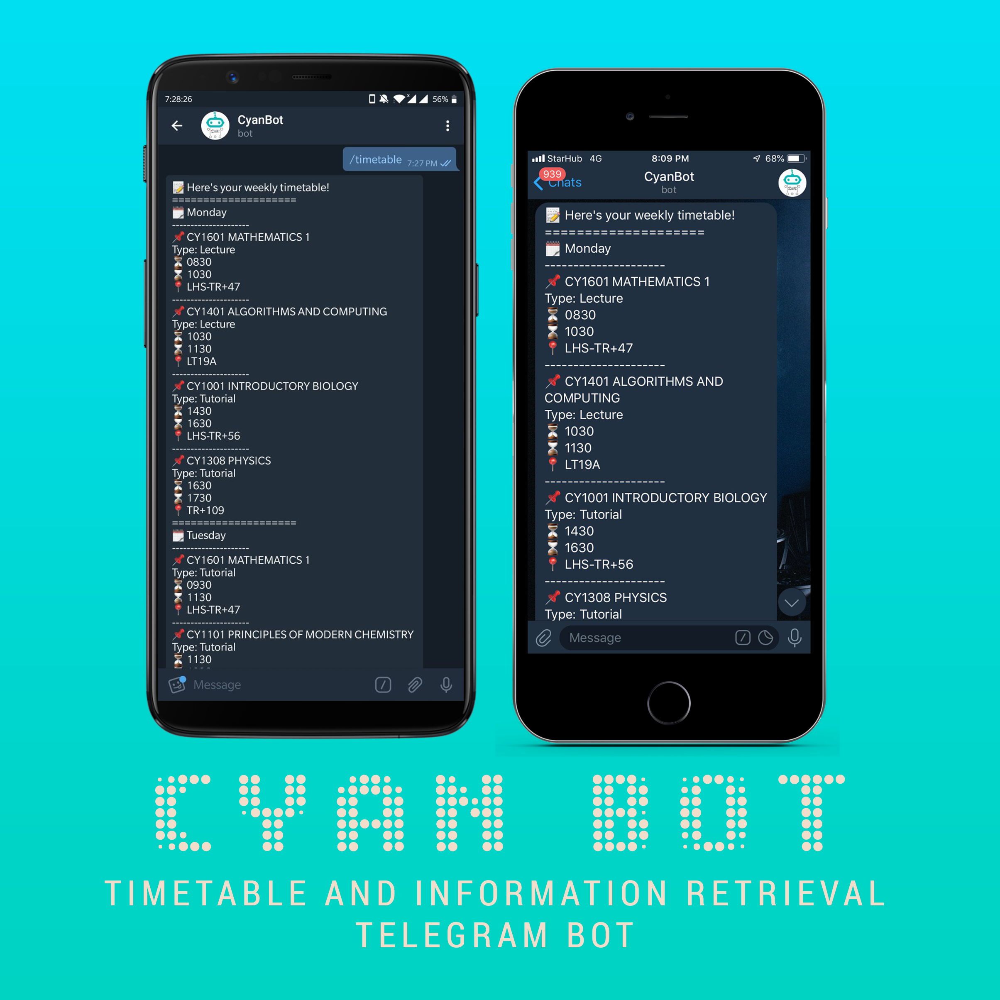

  

<h1 align="center">Timetable and Information Retrieval Bot Beta 0.9.0: CyanBot </h1> 

  
A Telegram chatbot to allow students to check timetable, event and student information stored in a database and send periodic reminders for lessons and events. 

Please read the [Disclaimer](DISCLAIMER.md) before proceeding.

### Usecase

* **Student groups and organisations** such as classes, CCAs can store their members' data and class timetable inside the database for easy retrieval, especially when the bot is added into a chat group. The bot can send periodic (daily or weekly) reminders about the timetable and events (such as assignments and assessments) for the next day or week.
* **Individuals** can use it to store their own timetable and information without the need to share with a group and it is relatively more convenient than having to open up another app to see their timetable, as Telegram is a widely used messaging platform. 

### Commands

* **/start**
>  Starts the bot

* **/calendar**

>  Retrieves the academic timetable from a stored link 

* **/today**

>  Sends the timetable and events for today

* **/tomorrow**

>  Sends the timetable and events for tomorrow

* **/timetable**

>  Sends the timetable for the week

* **/reminders**

>  Enables daily and weekly reminders which include events and timetable to be sent

* **/help**

>  Sends the full list of commands available, including how to store and retrieve information on persons, classes and events

### Running your own instance

* Obtain bot token from @BotFather on Telegram
* Set up MongoDB cluster
* Host on suitable platform. Current source code is written to be [deployed on Heroku](https://github.com/python-telegram-bot/python-telegram-bot/wiki/Where-to-host-Telegram-Bots). However, as the hosting is free, one gets the reliability and uptime one pays for. 

### Future Work

* Make UX more friendly and smooth, by adding in conversation handlers instead of the bot just responding to commands
* Add in support for multiple uses for a single instance, by being able to create more than one database per running instance
* Add in web scrapping, pdf parsing and ripping of timetables from online sites and portals once I have access to them. 

### Credits

Authors of all libraries / modules used in the inspiration for and development of this bot, in no particular order:
* [Python Telegram Bot](https://github.com/python-telegram-bot/python-telegram-bot) - the most functional Python wrapper for the telegram bot API.
* [PyMongo](https://github.com/mongodb/mongo-python-driver) - PyMongo is objectively the best raw mongo connector for Python, coming with a default connection pool enabled by default. 
* [MongoDB](https://www.mongodb.com/) - mongoDB is used as the database for this bot, with it being noSQL allows for easy information storage.
* [SIM-UoW Timetable Bot](https://github.com/xlanor/SIM-UoW-Timetable-bot) - Took inspiration from this amazing bot in crafting the functions and presentation for this bot.
